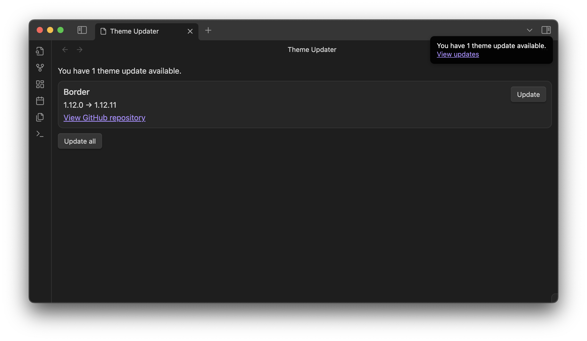

# Obsidian Theme Updater

Do you feel frustrated when you have to manually update your themes? This plugin will help you to update your themes from GitHub.

You will be notified when there are updates available, simple and easy UI to update the themes by button.

